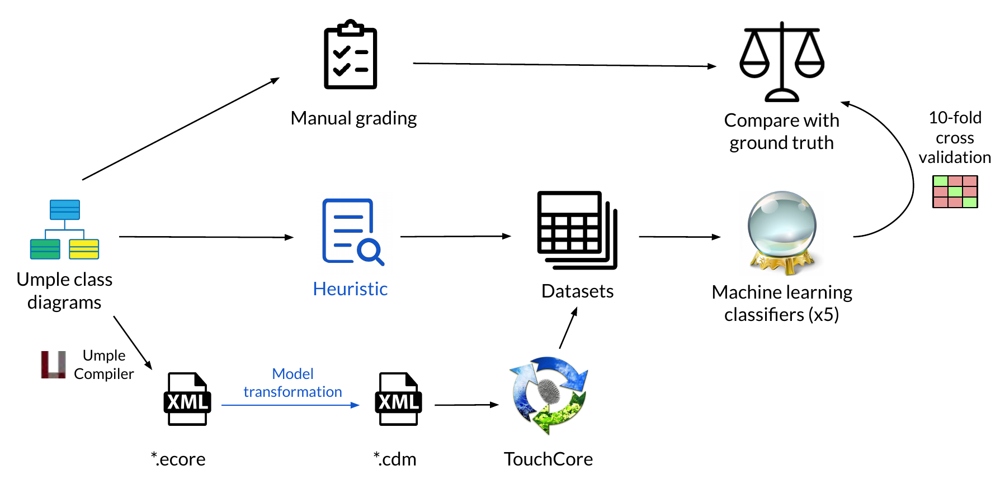

# UML Class Diagram Automated ML Grader

## Authors

[Younes Boubekeur](https://github.com/YounesB-McGill),
[Gunter Mussbacher](https://github.com/gmussbacher/),
[Shane McIntosh](https://github.com/smcintosh)

## About

This application grades student [UML class diagrams](https://www.omg.org/spec/UML/About-UML/) based on a model (ideal) solution.
It uses a heuristic and machine learning techniques to classify student submissions into higher or lower quality or predict their letter grade (A-F).

A research paper covering this tool was submitted to the [MODELS 2020 Conference](https://conf.researchr.org/home/models-2020).

## System components

The following image shows the grading process used for this project.

 

In this repository, we provide the following information:

1. Example student [assignment](data/assignment_sample_data) and
[final exam](data/final_exam_sample_data) submissions. We are unable to make 
the entire datasets public due to copyright and ethics considerations.
1. Data representing the [human grades](data/LG_grading_a2_final.csv), _i.e._,
the ground truth, for the assignment and final exam.
1. The code used to extract and clean the raw data.
1. The [heuristic algorithm](heuristic_grader.py).
1. The [machine learning predictors](predictor.py).
1. The Ecore to TouchCore class diagram model transformation [code](ecore2cdm.py).
1. The TouchCore model compare [automation script](tc_controller.sh).

Detailed instructions for running the code will be added here shortly.

## Dependency versions

Umple version: `445d1d99b542c85c9a694ef78a6dad5c7794b0b2`

TouchCore CORE version: `e66b47c444a04ded0a4d4aed1f23d40207de177e`

TouchCore RAM version: `5a067eab574c2dbd90af656d1bbfc7c34da1e7e0`

Versions of Python packages are shown in the `requirements.txt` file.
